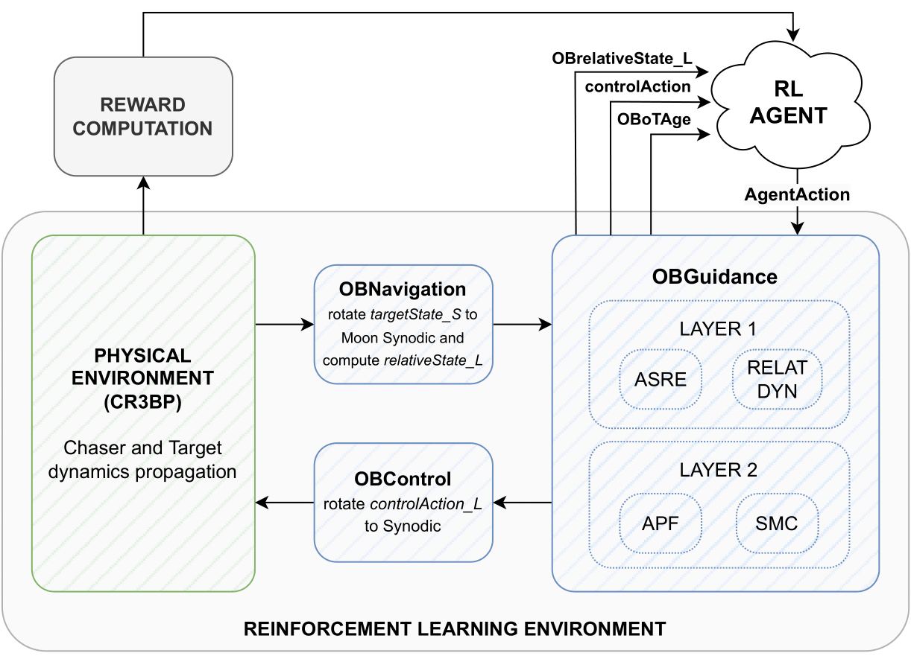

# _Employment of Reinforcement Learning to support state of the art Relative Guidance Methods_ #

## Overview
_relativeGuidance_ is a framework for simulating and analyzing relative guidance algorithms for space applications. This repository contains the code used in my Master's Thesis in Space Engineering at Politecnico di Milano.

### Features
- The main code is coded in python
- The validation code is 
- Simulation environment based on Gymnasium for RL applications
- Integration with Stable-Baselines3 for training RL-based controllers
- Support for multi-phase guidance strategies and different constraints
- Visualization tools for analyzing guidance performance

The code is structured as in figure:


the modularity in the code design allows to change any of the blocks, provided that all the others are fixed accordingly.

### Installation
Ensure you have Python 3.10 or later installed.

Clone the repository:
    git clone https://github.com/CarloZambaldo/relativeGuidance.git
    cd relativeGuidance

Install dependencies:
    pip install -r requirements.txt

## Usage

### Running a Simulation 
To run a simulation, execute the following command:

```python3 RLEnv_MC_Eval.py -p [PHASE_ID] -m [MODEL_NAME] -n [N_OF_SIMULATIONS] -s [SEED] -r [RENDERING_BOOL]```

> [!NOTE]
> only PHASE_ID parameter is required, the others are set to default as follows:
> ```[MODEL_NAME] = "_NO_AGENT_"```
> ```[N_OF_SIMULATIONS] = 1```
> ```[SEED] = None```
> ```[RENDERING_BOOL] = True```

> [!TIP]
> assign the seed only if reproducibility is required, otherwise avoid seeding

### Training the RL Agent
To train a reinforcement learning agent for a given environment, use:

```python RLEnv_Training.py -p [PHASE_ID] -m [NEW_MODEL_NAME] -r [RENDERING_BOOL]```

> [!IMPORTANT]
> to continue training an agent set the parameter ```--start-from [OLD_AGENT_NAME]```
> HOWEVER: this is highly discouraged if for training of the previous agent normalisation was set to True. Indeed, the new training does not load the old normalization!!

### Configuration
The repository includes two configuration files in the SimEnvRL/config/ directory, defining simulation parameters (env_conf) and RL training settings (RL_config).


### Repository Structure
    relativeGuidance/
    in README or documentation
    │ ├── RLFramework.png   # Framework diagram
    │
    ns and validation
    │ ├── extractSimulationData.m
    │ ├── MATLAB/           # Core MATLAB functions
    │ │ ├── APF.m, ASRE.m, ASRE_plus_Constraints.m
    on.m
    rixLVLH.m
    │ │ ├── config/ # Configuration scripts
    tializeSimulation.m
    │ │ │ ├── refTraj.mat
    on and plotting
    ion functions
    │ │ ├── relativeDynamicsModels/ # Dynamic models
    nPositionVersor.m
    n scripts
    │
    tion environment
    or RL environment
     __init__.py
    │ ├── envs/             # RL environment classes
    │ │ ├── RLEnvironment.py, __init__.py
    ns
     OBGuidance.py
     wrappers.py
    results
    │ │ ├── plots.py, printSummary.py, see.py
    ndencies
    │ ├── __init__.py
    │
     Carlo simulations (not included in this repository)
    │
    he RL environment via Monte Carlo simulations
     RL environment
    ├── LICENSE             # Project license
    └── README.md           # Project documentation
    

## Contributing
Contributions are welcome! To contribute:
- Fork the repository
- Create a new branch (git checkout -b feature-branch)
- Make your changes and commit (git commit -m "Add new feature")
- Push to your branch (git push origin feature-branch)
- Open a Pull Request

# License
Copyright (c) 2025 Carlo Zambaldo
This project is licensed under the MIT License - see the LICENSE file for details.

# Contact
For questions or collaborations, please contact Carlo Zambaldo.